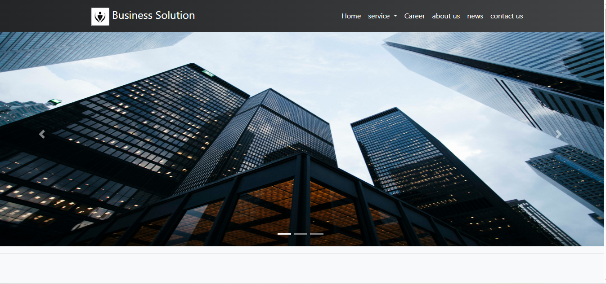

# 💼 Business Solution Website – UAE Based

This is a responsive and modern front-end website developed for a UAE-based business solutions provider. Built using HTML5, CSS3, Bootstrap, and JavaScript, the site presents professional services in a clean and engaging layout optimized for all devices.




## 🚀 Features

- ✅ Responsive design (Mobile, Tablet, Desktop)
- ✅ Clean and modern UI
- ✅ Bootstrap-powered layout
- ✅ Smooth navigation and interactive elements using JavaScript
- ✅ Professional service presentation
- ✅ Contact section with form (front-end only)
- ✅ Cross-browser compatible

---

## 🛠️ Technologies Used

- HTML5  
- CSS3  
- Bootstrap 4  
- JavaScript (Vanilla)

---

## 📁 How to Use

1. Clone the repository:
   ```bash
   git clone https://github.com/MHamza13git/Business-solutions.git

📄 License
This project is open-source and available under the MIT License.

For any questions or issues, please contact mhamzasheikh13@gmail.com
